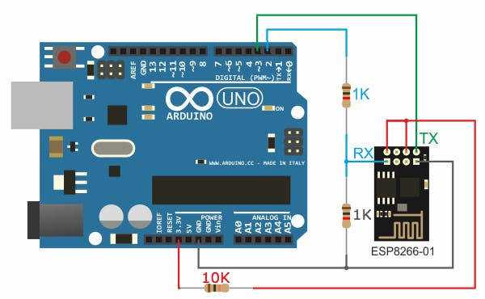

# Control Arduino device from React Native app 🌱

This is an example for controlling Arduino device from mobile app. Honestly, I suck at React Native, but iOS user can run it withuot macOS, so I chose it instead of Flutter.

## Add Wi-Fi module to your arduino project.

I guess this will work with any wifi module? I prefer to use ESP8266. I will write Arduino code example later.



## Get started with app

1. Install [Node.js](https://nodejs.org/en) if you don't already have it installed.

2. Clone this project `https://github.com/assanbayg/control-arduino-app.git` or [download ZIP](https://github.com/assanbayg/control-arduino-app/archive/refs/heads/main.zip).

3. Install Expo Go application on your phone.

4. Configure Firebase project. Remove `.example` from `.env.example` file.

5. Install dependencies

   ```bash
   npm install
   ```

6. Start the app

   ```bash
    npx expo start --tunnel
   ```

In the output, you'll find options to open the app in a

- [development build](https://docs.expo.dev/develop/development-builds/introduction/)
- [Android emulator](https://docs.expo.dev/workflow/android-studio-emulator/)
- [iOS simulator](https://docs.expo.dev/workflow/ios-simulator/)
- [Expo Go](https://expo.dev/go), a limited sandbox for trying out app development with Expo

Scan the QR code in the output with Expo Go (Android) or the Camera app (iOS)

## Additional
körimdik is accepted. Contact me in [Telegram](t.me/assanbayg) if you have any questions or need my Kaspi.
